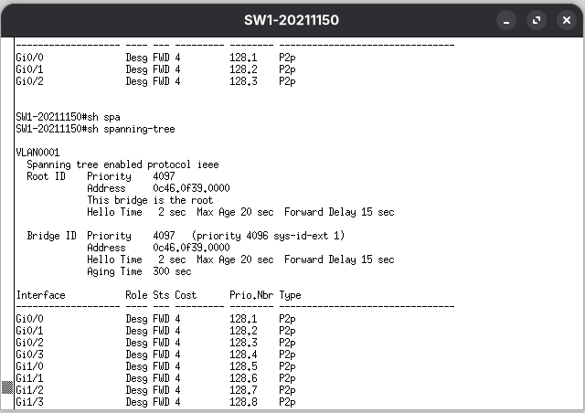
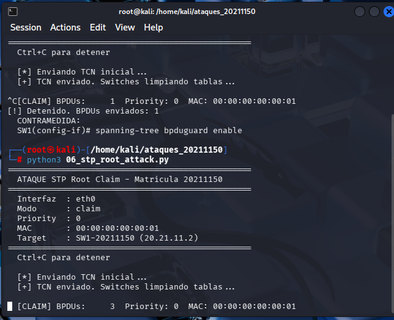
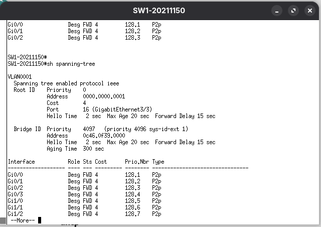
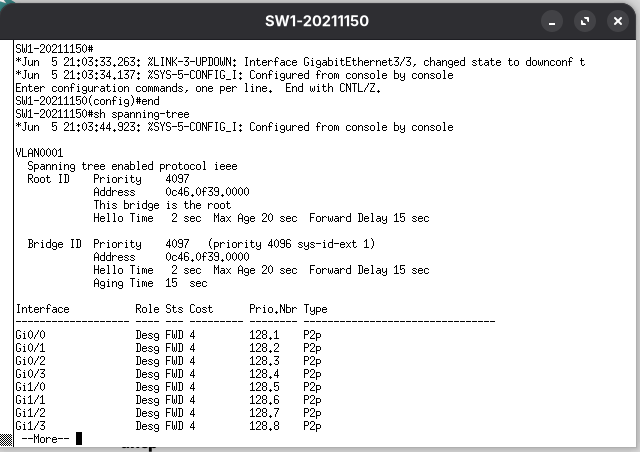

# STP-Claim-Root-Attack-20211150
Ataque STP Root Claim — Matrícula 20211150
**Autor:** Alvaro Smilk Baez Tavera
**Matrícula:** 20211150
**Fecha:** 5 Junio 2026

---

## Descripción
Script que reclama ser el Root Bridge de STP enviando 
BPDUs con prioridad 0 y MAC baja, forzando a los 
switches a reconfigurar el árbol de spanning tree y 
redirigir el tráfico hacia el atacante.

---

## Objetivo
Demostrar la vulnerabilidad de STP ante ataques de 
manipulación del Root Bridge, tomando control del 
árbol de spanning tree y aplicando las contramedidas.

---

## Topología
Router-20211150 (20.21.11.1)
|
SW1-20211150 (20.21.11.2)
/        
Kali Linux    PC1/PC2/PC3
(20.21.11.50) (Víctimas)
ROOT BRIDGE FALSO

## Direccionamiento
| Dispositivo | IP          | Interfaz | Rol            |
|-------------|-------------|----------|----------------|
| Router      | 20.21.11.1  | gi0/0    | Gateway        |
| SW1         | 20.21.11.2  | gi0/0    | Switch         |
| Kali Linux  | 20.21.11.50 | gi3/3    | Root Bridge    |
| PC1         | DHCP        | gi0/1    | Víctima        |
| PC2         | DHCP        | gi0/2    | Víctima        |
| PC3         | DHCP        | gi0/3    | Víctima        |

---

## Requisitos
- Python 3
- Scapy instalado
- Privilegios root
- BPDU Guard desactivado en el switch

### Instalación
```bash
pip3 install scapy --break-system-packages
```

---

## Parámetros del script
| Parámetro      | Valor             | Descripción               |
|----------------|-------------------|---------------------------|
| INTERFAZ       | eth0              | Interfaz del atacante     |
| BRIDGE_PRIORITY| 0                 | Prioridad máxima          |
| ATACANTE_MAC   | 00:00:00:00:00:01 | MAC baja garantiza ganar  |
| HELLO_INTERVAL | 1.0               | Segundos entre BPDUs      |
| MODO           | claim             | claim=estable flood=inestable |

---

## Uso
```bash
# Modo claim (Root Bridge estable):
sudo python3 06_stp_root_attack.py eth0 claim

# Modo flood (desestabilizar STP):
sudo python3 06_stp_root_attack.py eth0 flood
```

---

## Funcionamiento
1. Envía TCN inicial para limpiar tablas MAC
2. Envía BPDUs de configuración cada segundo:
   - Bridge Priority = 0 (máxima)
   - Path cost = 0
   - MAC = 00:00:00:00:00:01
3. SW1 recalcula y elige a Kali como Root Bridge
4. El tráfico se redirige hacia el atacante
5. Cada 10 hellos envía TCN para mantener tablas limpias

---

## Verificación del ataque
```bash
# En SW1 — ver cambio de Root Bridge:
show spanning-tree
# Root ID: 0000.0000.0001 ← MAC de Kali

show spanning-tree detail
# BPDUs recibidos del atacante

# Antes del ataque Root ID era SW1:
# Root ID: 32768.0c52.c15e.0001
```

---

## Capturas
### Antes — Root Bridge legítimo


### Script corriendo en Kali


### Root Bridge cambiado a Kali


### show spanning-tree con Kali como Root


---

## Contramedida
```bash
SW1-20211150(config)# spanning-tree portfast bpduguard default
SW1-20211150(config)# interface gi3/3
SW1-20211150(config-if)# spanning-tree bpduguard enable
SW1-20211150(config-if)# exit
SW1-20211150(config)# interface gi0/1
SW1-20211150(config-if)# spanning-tree guard root
SW1-20211150(config-if)# exit
SW1-20211150(config)# interface gi0/2
SW1-20211150(config-if)# spanning-tree guard root
SW1-20211150(config-if)# exit
SW1-20211150(config)# end
SW1-20211150# write memory

# Verificar:
SW1-20211150# show spanning-tree
SW1-20211150# show spanning-tree inconsistentports
```

### Verificación contramedida


---

## Video
[Ver demostración en YouTube](https://youtu.be/wYz70GQlVpY?si=OHsuh7yEfa7V2D2b)

---

## Referencias
- IEEE 802.1D Spanning Tree Protocol
- Cisco STP Security Best Practices
- Herramienta: Python 3 + Scapy
